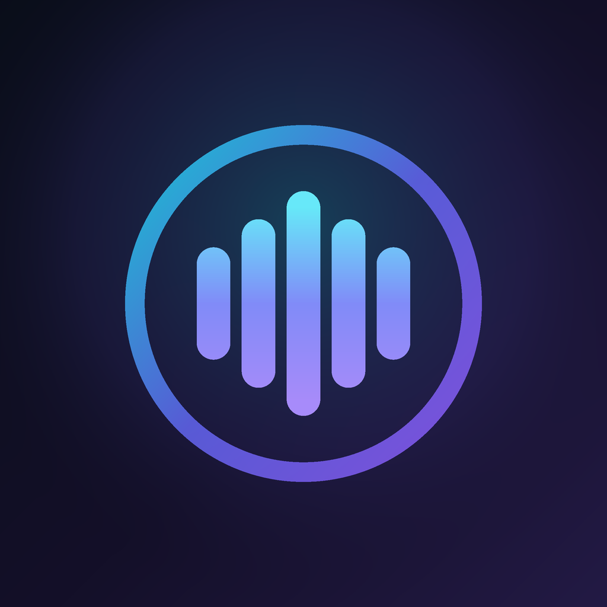

# Resonāda

### A bit-perfect, high-fidelity music player for Android — built for people who *hear* the difference.

`

**[⬇️ Download the latest APK](https://github.com/resonada/resonada/releases/latest)**

---

## ✨ What is Resonāda?

**Resonāda** is a no-compromise **local + streaming** music player for Android that treats your
audio chain with the respect it deserves. It ships its **own native audio engine** — a user-space
USB Audio driver that streams straight to your DAC, **bit-for-bit**, bypassing Android's mixer and
the phone's audio HAL entirely. On top of that sits a full **parametric DSP suite** and a set of
**analysis tools** most desktop software doesn't have: a live signal-path inspector, a real-time
audio X-ray, reference-grade fidelity metering and a calibrated spectrogram.

> Drop in your lossless library, plug in your DAC, and let the bits flow untouched — then *see* exactly what reaches your ears.

It's built for the listener who wants the truth about their music: is this file really hi-res, or an
upscaled fake? Is the signal actually bit-perfect right now, or is something in the path touching it?
Resonāda answers those questions, on-device, for every track.

---

## 🌟 Features

### 🔊 True bit-perfect playback — **bitXact**
- **Exclusive USB-DAC output.** A hand-written **USB Audio Class (UAC) driver** streams isochronous audio directly to your DAC's endpoint via `usbdevfs`, bypassing AudioFlinger and the OEM HAL — the same "true bit-perfect" approach as the best desktop players. The DAC is **reclocked to each track's exact sample rate** (44.1 / 48 / 88.2 / 96 / 176.4 / 192 / 352.8 / 384 kHz), with no hidden resampling.
- **Everything takes the native path** — lossless (FLAC, ALAC, WAV, AIFF, APE, WavPack) *and* lossy (MP3, AAC/M4A, Ogg/Vorbis, Opus, WMA) all reach the DAC bit-exact when one is connected.
- **Native DSD & DoP** — `.dsf` / `.dff` and **SACD disc images (`.iso`)** up to your DAC's limits, as raw native DSD or DoP; software DSD→PCM decimation when no DAC is present. **DSD packed as PCM (DoP)** inside FLAC / WAV / AIFF is detected and decoded as DSD — not played as noise. SACD ISOs appear as individual tracks straight from the disc's own table of contents.
- **Pure native DTS decoding** — DTS, DTS-ES, DTS 96/24, and full DTS-HD Master Audio decoded bit-perfectly with complete ID3v2 metadata handling and bit-perfect DAC pass-through.
- **DST compressed DSDIFF decoding** — Direct Stream Transfer (DST) compressed DSDIFF (`.dff`) files now decode natively with full bit-exact lossless fidelity.
- **APE (Monkey's Audio) & WavPack, done properly** — decoded by the official Monkey's Audio SDK and libwavpack, with APEv2 tag read *and* write (metadata, lyrics, cover art), gapless, seek, visualizer and full analysis. WavPack-DSD plays as high-rate PCM; hybrid `.wv` plays standalone.
- **Bit-perfect at any volume** — on DACs with a real hardware volume control, the app drives the DAC's own (often analog) volume while the digital stream stays untouched; when it must attenuate in software it uses **TPDF dither** instead of truncation.
- **Multichannel done right** — 5.1-and-beyond FLAC/WAV/AIFF/ALAC plays bit-perfect through a multichannel-capable USB DAC, with volume and ReplayGain applied evenly to every channel.
- **A badge that tells the truth.** The **bitXact** indicator reflects the *entire* signal path — it only lights up gold when the audio is genuinely bit-exact, and stays dim the moment DSP, software volume or a sample-rate conversion touches the stream.
- **Hi-res internal DACs are first-class too.** On phones and DAPs with a direct hi-res wired output (LG Quad DAC, Sony Xperia, hi-res DAPs), hi-res lossless automatically takes the native engine's exclusive source-rate path — no settings hunt — and earns its own dedicated purple **Direct BitXact** or teal **Native · exclusive** seal (never the gold bitXact glow, which stays reserved for the verifiable USB path).

### 🔌 Deep USB-DAC insight
- Full **UAC descriptor decode** — product / manufacturer / VID / PID, UAC1 vs UAC2, interface and endpoint layout, every **supported rate, bit depth and format**, native-DSD capability, and whether the DAC exposes a usable **hardware-volume feature unit**.
- **Live stream health** — real-time clock drift (PPM), active-stream state, and the platform's own bit-perfect-mixer status alongside the app's exclusive path.
- **Output Devices hub** — a drawer screen for **phone / USB DAC / Bluetooth**: tap to route audio, save a **per-device profile** (exclusive, DSD mode, volume path, allowed rates, **DAC start pad**…), re-apply on reconnect, plus optional keep-screen-on and wake-on-track while playing.
- **Studio resampler** — on speaker or Bluetooth, hi-res files convert **in the app** to the mixer rate so Android's mixer does not alias them. Exclusive USB is never resampled. Toggle on Output Devices (on by default).
- **DAC start pad** — optional silence (None…3000 ms) on exclusive USB **cold-start** so dongles that mute or fade the first notes can wake before the music; gapless same-format advances and pause/resume stay snappy.

### 🎚️ Universe DSP
- **Dynamic DSP node reordering & profile sharing** — drag to reorder processor cards and reshape the real-time DSP pipeline with zero heap allocations, guided by an intelligent Topology Advisor. Full DSP profiles can be exported to JSON, saved, shared, or imported with schema validation.
- **Up to 32-band parametric EQ** with true RBJ biquads and click-free coefficient ramping.
- **Convolution** (impulse-response) for headphone & room correction, plus **crossfeed** and **compressor / limiter** dynamics.
- **AutoEQ, built in** — import oratory1990 / Crinacle-style profiles, or search the headphone-correction catalogue in-app and apply with one tap; the catalogue **keeps itself current** with a weekly refresh from the upstream project.
- **On-device PEQ optimizer** — import frequency-response measurements (Squiglink / Crinacle CSV exports) and generate a parametric EQ curve toward Harman IE, Harman OE, or a custom target — entirely on-device, no cloud needed.
- **DSP presets** — save your current sound under a name and recall it anytime; every value readout is **tap-to-type** for exact numbers, and a one-tap **Reset** restores flat defaults.
- **DSP precision selector** — choose between standard (32-bit float) and audiophile-grade (64-bit double) precision for volume and ReplayGain control.
- **Binaural HRTF** — fold multichannel (5.1/7.1) to stereo through measured Neumann KU100 HRTFs on **USB DAC, Bluetooth, and phone speaker** (not USB-only); load your own AES69 `.sofa` sets and switch them live.
- **ReplayGain**, and **crossfade** with selectable curves (linear / equal-power / exponential / logarithmic).
- **A/B compare** two settings instantly, a **colourful response curve** and a live **real-time analyser (RTA)**.

### 🔬 Analysis & insight *(the part no one else has)*
- **Signal Path (Audio path)** — a live, stage-by-stage view of what happens between the file and your ears: source → decoder → sample-rate converter → DSP chain → output, each annotated with the real format and state, plus a **Signal Integrity** score and the exact reason a track *isn't* bit-perfect.
- **Audio X-Ray** — real-time spectral + dynamics read-out of the actual PCM feeding your output: band energy, stereo width, dynamic range, compression, peak / true-peak / RMS, bandwidth and phase correlation — with a plain-language "why does this track sound bad?" diagnosis. Fully local; nothing is uploaded.
- **Fidelity analysis & scoring** — reference-grade, whole-track metering: **DR** dynamic range, **True Peak (dBTP)** with inter-sample overs, **LUFS + LRA** to EBU R128 / ITU-R BS.1770-4, clipping detection, **effective bit depth**, and **fake-FLAC / lossy-upscale detection** with a confidence level (Confirmed / Likely / Possible). Graded Poor → Reference.
- **Calibrated spectrogram** — per-channel FFT to the true Nyquist, a full-scale tone reads exactly 0 dB, with the fidelity verdict and detected frequency cutoff drawn right on the image, tap-any-point read-out, a dB colour scale, and one-tap **image export** with the methodology. **Pinch-zoom genuinely re-analyses** the region at a growing FFT size (2048 → 8192), and channel views (Stereo / L / R / Mid / **Side**) expose joint-stereo artifacts and fake-stereo upmixes.
- **BPM & musical-key detection** for any track, including DSD — with a one-tap batch pass that analyses every track still missing them.
- **R128 loudness scanning** — measure true EBU R128 loudness from album and artist menus and fill in ReplayGain 2.0 track + album gain for untagged files, so volume levelling works on any library with no desktop tagging.

### ⬆️ Experimental upsampling *(opt-in)*
Reconstruct lossless PCM to a higher sample rate through a reference-class linear-phase filter before your USB DAC — "Max" auto-picks the highest whole-number multiple your DAC supports, or pick a fixed 2× / 4× / 8×. Clearly labelled *not* bit-perfect, off by default, and it never touches the bit-perfect path.

### 📚 Library & metadata
- Fast **incremental, parallel on-device scan** that updates only what changed, across **internal storage, SD cards and multiple folders**, all merged into one library — with **all-files access** (reads tags and artwork from the files themselves, not Android’s media index) or per-folder picks, and **exclude-subfolder** rules.
- **Media Library** (sidebar) — one place for sources, scan, and keep-screen-on while scanning, plus library policies: **split album by path**, **Title Case** names, **ignore WAV metadata**, **guess tags from file name**, and **cover art priority** (folder vs embedded). Multi-disc sets stay **one album** with Disc 1 / Disc 2 sections from disc tags.
- **CUE single-file albums** — one long FLAC/WAV/AIFF/ALAC with a `.cue` beside it appears and plays as its individual tracks, on both the standard and bit-perfect paths.
- **Collaborative tracks & artist disambiguation** — collaborative tracks offer a dedicated disambiguation sheet to explore individual artists or shared works, complemented by an Appears On catalog section on artist detail screens.
- **Album custom fields & customizable track cards** — albums support custom metadata fields with automatic bidirectional track synchronization, and main track cards feature optional toggles for audio quality chip, duration, musical analysis, and folder path.
- **Smartlists** — rule-based library lists with presets (Recently Added, Most Played, Never Played, Rediscover, Hi-Res, Verified Lossless, and more), a **Rule Builder** for your own lists, **custom fields**, multi-select Smart chips, and play / shuffle / queue from the Smart tab. Fully on-device.
- **Tag editor** that reads and writes the full hi-res tag set (composer, ISRC, label, catalog #, BPM, key, lyrics and more) — type fields by hand or use online lookup / AcoustID fingerprint match (including genre, track and disc from MusicBrainz) — with **cover-art** embed / folder-sidecar. **Album Edit tags** from the Albums list (⋮ / long-press) or Album detail: **Fetch online** (one release for the whole album) or **Edit manually** (album-level fields + cover applied to every track). **Star ratings (1–5)** embed into the file's own tags so they travel with your library.
- **Filter chips on every tab** — Favorites, Hi-Res, DSD, FLAC, Genre, Decade, Rating and an Added 7/30/90-day window narrow Songs, Albums, Artists and Playlists instantly; Albums sort by Year / Date added, Artists by Date added.
- **Playlists** with **.m3u import / export**, **save the current queue** to a playlist (remote streams filtered out), and **AI-assisted playlist** generation from a prompt.
- A built-in **folder browser** so you can add any folder without fighting Android's system picker.
- **Open with / Share** — Resonāda appears in Android's system chooser and share sheet for audio files, so you can open a track from Files or another app straight into the player.

### 🎤 Lyrics
- **Synced, word-level karaoke lyrics** with a highlight that follows the beat, loaded from LRC / TTML / KRC / YRC / QRC / **Lyricsfile** (beside a track or embedded). **Type size** XS–XL and **Sans / Serif / Mono**, persisted. LrcLib instrumentals show as **Instrumental** and persist as official Lyricsfile YAML.
- **Lyrics canvases** — Void, Aura, Kinetic, Prism, Monolith, Gradient, plus **Noir** (silver Ken Burns), **Bloom** (palette orbs), **Cinema** (letterbox + warm grade), and **Fluid** (cover-art wash, left-aligned white text). Cinema and Fluid continue under the status bar and visualizer.
- **Choose your source** — preview and pick from multiple online lyric providers before applying (including zero-friction Genius and Lyrics.ovh, plus Wikipedia album metadata and artist biographies). Optional **HTTP/SOCKS5 proxy** in Settings for QQ Music / KuGou / NetEase when those hosts are blocked.
- **Inline translation** — translate synced lyrics to your language right in the view, on-device and **offline** (free), or with your own cloud translation key for higher quality.
- **AI transcription** for tracks that have no lyrics anywhere.

### 🏠 Home & discovery
- A **personalized Home** — a time-of-day greeting, "Jump back in", Recently added, Rediscover, your top tracks and favourites.
- **Flow (✦)** — when the queue runs out, playback keeps going with on-device picks that sound like what you were playing; Flow tracks are badged in the queue, skips teach the session what to avoid, and nothing leaves the phone.
- **On-device discovery intelligence** — **Daily Mixes** built from the artists you actually play (favourites-weighted familiar + similar-by-sound novel picks, tempo-flow ordered, refreshed daily) and a **"Sounds like"** action that queues your library's closest matches by genre, tempo, harmonic key and era. Entirely local: no network, no accounts, zero effect on playback.
- An optional **discovery feed** — worldwide trending & new releases with artist write-ups, plus "More from artists you love" built from your own library.
- **News & articles** (subscribe to any RSS/Atom feed) and **artist / album bios** — all off by default.

### ☁️ Sources & network
- **Jellyfin streaming & music client** — connect directly to your Jellyfin server via PIN Quick Connect; browse Genres, Albums, Artists and Playlists; launch Instant Mix radio; sync server favorites, report real-time playback sessions, and fetch server lyrics.
- Stream from **network shares (WebDAV, FTP, SFTP, SMB)**, **Dropbox**, **DLNA / UPnP** servers, **the Internet Archive**, **internet radio** and **podcasts** — radio station files (`.m3u`/`.m3u8`) can be picked from storage or are **auto-discovered** and offered as ready-to-browse sources.
- **Subsonic / Navidrome** (and compatible servers) — browse playlists, starred, random, artists and search; heart a track in the app and it **stars on the server** so it shows up on your PC.
- **Popular music-streaming services** connect with your own account for search, streaming and downloads — including your account **Favourites and Playlists** as browsable tabs.
- **In-app Bluetooth codec control** — apply your chosen codec (LDAC / aptX / AAC / SBC), sample rate, bit depth and LDAC quality to the live headphone link after a one-time companion pairing; no Developer Options needed.
- **AuxBridge — play any app through your USB DAC.** Capture the audio of any other app (streaming services, browsers, games) with Android's playback-capture consent flow and stream it straight to your DAC through Resonāda's own exclusive driver — pick a capture rate (44.1–192 kHz), keep the volume law, DSP and visualizers, and hand back cleanly the moment you start normal playback. Honest by design: clearly labeled *not* bitXact, since Android decodes and mixes the source first.
- **Cast to DLNA renderers** (smart TVs, AV receivers, network speakers) with full session control — play/pause, next/previous, seek, track picks and even the volume keys drive the renderer while casting, and local files are served to it straight from the phone.
- A **cloud cache** with a user-set size cap keeps streamed tracks for reliable, bit-perfect local playback (or stream directly with nothing stored).
- Turn your phone into a **UPnP / DLNA renderer *and* media server** on your network — a dependency-free, self-contained implementation.

### 🤖 Automation & Integrations
- **Home Screen Widgets** — interactive audiophile home-screen widgets with live previews: **Daily Discovery**, **DAC & Bit-Perfect Signal Path Monitor**, and **Vintage Analog VU Meter**.
- **Discord Rich Presence** — native Discord gateway integration to display track, artist, album, audio fidelity badge, and live progress directly on your Discord profile without companion apps.
- **Android Auto** — full support for Android Auto dashboards, including library browsing, voice search, and seamless playback resumption.
- **In-app rule engine** — create when→then rules (USB/BT/playback triggers → volume, playback, route, EQ actions) with AND/OR logic and time conditions.
- **Tasker/MacroDroid Plugin** — a native Action Plugin UI lets third-party apps control Resonāda without typing raw intents. Includes direct import/export to device storage.

### 📈 Stats & scrobbling
- **Last.fm** and **ListenBrainz** scrobbling with configurable thresholds.
- Rich **listening statistics & insights**, plus a per-track **Track Insights** sheet with open-data enrichment (MusicBrainz, Last.fm, and more).

### 🎨 A crafted experience
- **Liquid Floating Navigation Pill & Spring Physics** — floating bottom navigation pill with momentum stretch-and-squash physics, critically damped spring motion, tactile haptics, and edge-clamped boundaries on tab switches. Home category tabs feature matching spring velocity sliding pills with directional page switching.
- **Edge-to-edge Now Playing modal sheet** — interactive 1:1 swipe-to-dismiss gesture, MiniPlayer horizontal swipe-to-skip, and upward drag gestures.
- **Liquid Glass UI & Floating Vector Icons** — system-wide translucent acrylic surfaces, signature Resonada acoustic prism refraction, and dynamic ambient glow with selectable Studio Disk and Pure Floating hairline vector icon themes.
- **Mini lyrics ticker** — real-time mini lyrics ticker directly beneath the hero album art with seamless background blending, syllable-level sweep highlight, and tap-to-expand.
- **Animated Video Canvas & Immersive Canvas** — selectable stream quality (High 1080p, Standard 720p, Data Saver 480p) with instant dynamic stream resolution switching, aspect-fill center cropping, plus a full-bleed **Immersive Canvas** ambient background with readability scrims.
- Clean **Material 3** design with a true **AMOLED-black** theme option (pixels fully off on OLED panels).
- **Speaks five languages** — English, Spanish, Hindi, Russian and Simplified Chinese, switchable in-app or following the system's per-app language setting; every screen, dialog and toast is translated (missing keys fall back to English).
- **Seven playback modes** from the repeat button — Sequential, loop list, play list once, loop track, play track once (stay or cue next), and **A–B repeat** with tap-to-mark loop points — identical on both engines, persisted across restarts.
- **Shuffle algorithm** — Standard, Memory Efficient, or **Smart Spreading** (spaces artists and albums for optimal psychoacoustic flow) in Settings → Playback. Enqueueing tracks or selecting "Play Next" while Shuffle is active now preserves their exact order, splicing them directly into the shuffle sequence without scattering.
- **Playback tempo** — pitch-preserved speed control (0.5–2.0×) from Now Playing tools on the standard player path; locked at 1× when bitXact / native exclusive USB or DSD is active so the pure path stays honest.
- **5 selectable launcher icons** whose gradient flows into the in-app accents.
- A premium, animated **cosmic-dance About** screen — tap to sound the Oṃ.
- **Per-track quick tools** — Info, Metadata, Lyrics, Sleep timer, Tempo, X-Ray and Spectrogram, all one tap from Now Playing.
- **Seek bar styles** — Waveform (default), **Wavy**, **Squiggly**, **Trace** (file peak/RMS), Hairline, Classic, **Pill**, **Glow**, or **Notch** — Settings → Visuals; spectrum visualizer uses fixed frequency colours while ambient styles stay rainbow.
- **Cover corner** — Sharp / Soft / Default / Round / Circle on Now Playing and album/artist heroes.
- **Ambient backdrops** — 10 premium ambient styles for Now Playing (Obsidian Void, Adaptive Chrome, Astral Glow, Resonance Field, Ethereal Mesh, Prismatic Drift, Deep Noir, Luminous Bloom, Fluid Canvas, Cinema Wash) with a **Gradient richness** slider (Minimal / Balanced / Rich / Vivid) and optional dynamic flow.
- **Center search orb** on the bottom nav opens library search (tracks / albums / artists / playlists) from any tab.
- **Sleep timer**, **native gapless** (experimental), optional premium screen transitions, and one-tap **update-on-launch** for side-loaded installs.

### 🧩 Built to last
- A pure **native C++ audio engine** (Oboe) with **streaming decoders** — memory stays bounded no matter the file size.
- Plays **multi-hour, multi-gigabyte** hi-res and DSD files (including big single-file / CUE albums) end to end, with 64-bit file addressing so seeking stays accurate the whole way through.
- No analytics, no ads, no account required.

---

## 📲 Install

> Requires **Android 8.1 (API 27)** or newer.

1. Open the **[latest release](https://github.com/resonada/resonada/releases/latest)** and download the `.apk` (pick **`arm64-v8a`** for any phone made since 2017).
2. On your phone, tap the downloaded file.
3. If prompted, allow **"Install unknown apps"** for your browser / file manager.
4. Tap **Install**, then open **Resonāda**.
5. Grant audio / storage access so it can scan your library, and (optionally) allow it to skip battery optimization for uninterrupted background playback.

The APK is **signed**; updates with the same signature install over the top **without data loss**.

### 🎵 Supported formats
**Lossless & hi-res:** FLAC · ALAC · WAV · AIFF · APE (Monkey's Audio) · WavPack · DSD (DSF / DFF / SACD ISO)
**Lossy:** MP3 · AAC / M4A · Ogg / Vorbis · Opus · WMA
**Surround (decoded to stereo PCM):** Dolby Digital / Atmos (EAC3-JOC) · AC-3 · AC-4 · DTS

---

## 📸 Screenshots

|          Now Playing (bitXact)          |            Personalized Home            |             Signal Path             |
| :-------------------------------------: | :-------------------------------------: | :---------------------------------: |
|    |    |    |
|             **Audio X-Ray**             |          **Fidelity Analysis**          |           **Spectrogram**           |
|    |    |    |
|        **Parametric EQ / DSP**          |          **USB DAC details**            |     **Synced lyrics + translate**   |
|    |    |    |
|          **Per-track tools**            |           **Music library**             |            **Navigation**           |
|    |    |    |

More DSP, settings and analysis screens in the <a href="ResonadaScreenshots/">screenshots</a> folder.

---

## 🗒️ Releases

All builds are published on the **[Releases](https://github.com/resonada/resonada/releases)** page,
with notes describing what changed. The current line is **`Resonāda — 2.0.7.8 · Pratibimba · reflection`**.

---

## ❓ FAQ

**Will it work with my USB DAC?**
Most UAC-compliant USB DACs are supported for exclusive, bit-perfect output — including native DSD and hardware-volume passthrough where the DAC exposes them. The **USB DAC details** screen shows exactly what your DAC reports — including an honest **Path** (native UAC vs shared vs Android 14 mixer lock) separate from the bitXact outcome badge.

**Do I need a DAC to use it?**
No. Without a USB DAC it's a full-featured local + streaming player on your phone's own output; the bit-perfect exclusive path simply engages when a supported DAC is connected — and on phones with a direct hi-res wired output, hi-res lossless takes an exclusive source-rate path on the internal DAC automatically.

**Is my music or usage uploaded anywhere?**
No. Scanning, playback and all analysis (X-Ray, fidelity, spectrogram) run **entirely on-device**. Online features (metadata, lyrics, discovery, scrobbling) are opt-in and only contact the services you enable.

**Is the source code available?**
This repository distributes the official signed builds. The source is maintained privately.

---

## 💬 Community

Join the **[Resonāda Telegram group](https://t.me/+urRX_WELImQ0MjU1)** for release
announcements, early builds, help and feedback — and to share what your DAC is doing.

---

## 📜 License

**© 2026 R Kaurav. All rights reserved.**

Resonāda is **proprietary freeware** — free to download and use for
personal, non-commercial listening, but it is **not** open source.

You **may**:
- Install and use the official signed builds on your own devices, at no cost.
- Share a link to the [Releases page](https://github.com/resonada/resonada/releases).

You **may not**:
- Decompile, reverse-engineer, modify, or create derivative works of the app.
- Redistribute, rehost, or sell the APK or any part of it.
- Use the name, icons, or assets without written permission.

The software is provided **"as is", without warranty of any kind**, express or
implied. The author is not liable for any damages arising from its use.

Third-party open-source components are used under their respective licenses
(e.g. the bundled Apple ALAC decoder under the Apache License 2.0). The full
list of components and their notices is available in-app under
**Settings → About → Open-source licenses**.

For any other use, contact the author at **ralkau@proton.me**.

---

**Resonāda** — _the vibrating point of origin._

Made with care by **R Kaurav**.

Keywords: audiophile android music player · bit-perfect · USB DAC · UAC · hi-res audio · FLAC · ALAC · APE · Monkey's Audio · WavPack · DSD · SACD ISO · lossless · exclusive output · smartlists · output devices · Flow · parametric EQ · convolution · DSP · fidelity analysis · spectrogram · synced lyrics · Subsonic · Navidrome · DLNA · UPnP · WebDAV · Last.fm · ListenBrainz

